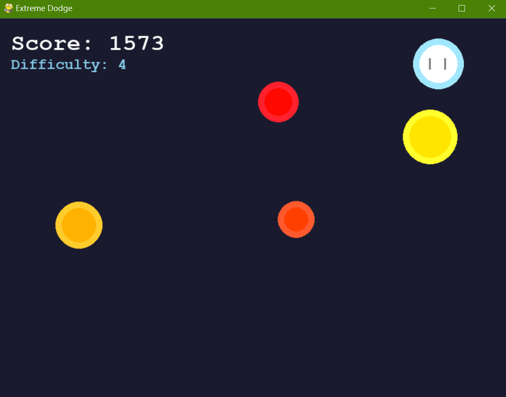

# Extreme Dodge Game (VB.NET & Python)

#### VB.NET Version:

#### Python Version:


## Description
This project is a fast-paced dodge game where you control a player character avoiding enemies that spawn from screen edges. The game features increasing difficulty, particle effects, and game over ranking system, but as a current limitation, <u>it does not have a pause option or sound effects.</u>

**Controls**: Move the player character by tracking mouse position. Press 'R' to restart after game over.

## Features
- **Player Control**: Move the player character by tracking mouse position
- **Enemy AI**: Enemies spawn from screen edges and track the player's movement
- **Collision Detection**: Player vs enemy collisions and enemy vs enemy collisions
- **Particle Effects**: Explosions when collisions occur
- **Scoring System**: Points increase over time and when enemies are dodged
- **Progressive Difficulty**: Every 500 points increases enemy spawn rate and speed
- **Game Over Screen**: Shows final score, survival time, and rank
- **Restart Functionality**: Press 'R' to restart after game over
- **Resizable Windows**: Both versions support window resizing with proper scaling

## Requirements

### Python Version
- [Python 3.12+](https://www.python.org/downloads/release/python-3120/)
- pygame-ce 2.5.6+: Install using `pip install pygame-ce`
### VB.NET Version
- [Visual Studio 2026](https://visualstudio.microsoft.com/vs/community/)
- [.NET SDK 10.0](https://dotnet.microsoft.com/download/dotnet/10.0)

## Installation & How to Run
First, clone this repository and navigate to the project directory:
```bash
git clone https://github.com/Pac-Dessert1436/Extreme-Dodge-VB-Python.git
cd Extreme-Dodge-VB-Python
```

### Python Version
```bash
python extreme_dodge.py
```
### VB.NET Version
1. Open the project in Visual Studio
2. Build the solution (Ctrl+Shift+B)
3. Run the application (F5)

## Gameplay Mechanics

### Scoring
- +1 point per frame survived
- +10 points for each enemy that leaves the screen
- +20 points for each enemy collision (when two enemies crash into each other)

### Difficulty
- Difficulty level increases every 500 points
- Higher difficulty reduces enemy spawn interval and increases enemy speed
- Maximum difficulty caps at spawn interval of 30 frames

### Ranks
Based on final score:
- **Newbie Warrior**: < 500 points
- **Dodge Apprentice**: 500-999 points
- **Movement Master**: 1000-1999 points
- **Extreme Survivor**: 2000-4999 points
- **Legendary Dodger**: 5000+ points

## Project Structure

```
Extreme-Dodge-VB-Python/
├── extreme_dodge.py      # Python version of the game
├── frmMain.vb           # VB.NET main form
├── frmMain.Designer.vb  # VB.NET form designer code
├── Essentials.vb        # VB.NET game utilities and classes
└── README.md            # This documentation file
```

## Development Notes

### Python Implementation
- Uses `pygame-ce` for graphics and input handling
- Implements a game loop with fixed FPS (60)
- Uses object-oriented design with separate classes for each game entity
- Features smooth animations with double buffering

### VB.NET Implementation
- Uses Windows Forms for the UI framework
- Implements high-quality rendering with `Graphics.SmoothingMode` and `Graphics.InterpolationMode`
- Uses a timer-based game loop
- Features proper resource management and cleanup

### Common Features
Both versions maintain identical gameplay mechanics:
- Enemy spawning from all four screen edges
- Collision detection using circle-circle algorithm
- Smooth player movement towards mouse position
- Particle explosion effects on collisions
- Game over state with fixed survival time

## License
This project is open source and available under the MIT License.
